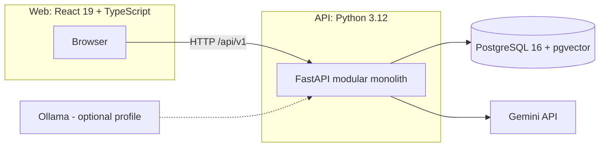

# Decision Memory Assistant

A local-data-first application that converts project notes, specifications, meeting records, PDFs, and Word documents into a searchable history of decisions. Ask questions such as *"Why was authentication postponed, who decided it, and was it later changed?"* and get a concise cited answer, an ordered decision timeline, and exact source passages.

The system distinguishes supported facts from conflicts and missing evidence. It does not fill gaps with model-generated assumptions: when evidence is absent it abstains, and when evidence conflicts it shows the competing passages instead of silently picking a winner.

---

## Quick Start

Host requirements:

- **Git** and **Docker Desktop**
- A free-tier **Gemini API key** and network access for live inference (only needed for live model calls; the deterministic suite and fake smoke run offline)
- No host Python, Node, npm, or PostgreSQL — every command runs through Docker Compose

```bash
git clone <this-repo>
cd decision_assistant

# Keep an existing .env unchanged. Add GEMINI_API_KEY to it before continuing.
cp -n .env.example .env

# Clean rebuild. WARNING: this deletes this project's Docker volumes and data.
docker compose down \
  --volumes \
  --remove-orphans \
  --rmi all
docker compose build --no-cache --pull

# Start PostgreSQL, create the schema, then start the application.
docker compose up -d db --wait
docker compose run --rm api alembic upgrade head
docker compose up -d api web --wait

# Verify the migration and service readiness.
docker compose exec api alembic current
curl -i http://localhost:8000/ready
docker compose ps

# macOS: open the web UI. On other systems, visit the same URL in a browser.
open http://localhost:5173
```

After a normal code change, a destructive clean rebuild is usually unnecessary. Run
`docker compose build`, `docker compose run --rm api alembic upgrade head`, and
`docker compose up -d --wait` instead.

- **Unversioned `GET /health`** — process/database liveness. Stays green in provider-degraded, schema-migration-pending, or corpus-reset-required states.
- **Unversioned `GET /ready`** — `200` only when the database schema is current, the selected providers have their required configuration, and no corpus reset is required; otherwise a sanitized `503`. It checks configuration *presence*, not remote credential validity.
- **`/docs`** — interactive FastAPI OpenAPI documentation.

The API binds locally by default, has no authentication, and must not be exposed publicly.

---

## What It Does

| Capability | Behavior |
|---|---|
| **Ingest** | `.md`, `.txt`, `.pdf`, `.docx` with exact page/paragraph/line locators. Empty/scanned PDFs are rejected as `ocr_not_supported`; password-protected and corrupt files get explicit errors. |
| **Extract decisions** | Schema-constrained extraction of statement, date, owner, status, reasons, alternatives, topic, and candidate relationships, each aligned to an exact source passage. |
| **Correct** | Users edit structured fields without touching source text. Every correction writes an audit revision and is labeled `supported`, `unsupported`, or `needs_review`. |
| **Retrieve** | Hybrid retrieval: vector search + PostgreSQL full-text (English) + structured decision fields, fused with Reciprocal Rank Fusion. Every query stores an inspectable trace. |
| **Answer** | Cited, atomic claims with a deterministic structural verifier, conflict display, and explicit partial/full abstention. |
| **Timeline** | Chronological, evidence-backed decision history with `supersedes` / `revises` / `relates_to` relationships. |
| **Evaluate** | A versioned ~20-question benchmark comparing semantic-only and hybrid retrieval with documented metrics. |

---

## Architecture

Three local components run under Docker Compose:



- **Web** — React 19, TypeScript, Vite, React Router. Browser routes are unversioned (`/`, `/ask`, `/timeline`, `/decisions/:id`, `/evaluation`).
- **API** — a single-worker FastAPI modular monolith. It owns ingestion orchestration, domain rules, retrieval, answer construction, evaluation, provider calls, and secret isolation.
- **Database** — PostgreSQL 16 with pgvector, managed by Alembic.
- **Providers** — Gemini is the default generation and embedding provider behind application-owned interfaces. A deterministic fake keeps tests offline. Ollama remains an optional adapter behind the `ollama` Compose profile.

All public business endpoints use the `/api/v1` prefix. `/health`, `/ready`, `/docs`, and `/openapi.json` remain unversioned. No unversioned compatibility aliases exist because no external client predates this contract.

### Module boundaries

| Module | Responsibility |
|---|---|
| `workspace` | Single workspace, configuration, corpus-active embedding/chunking profiles, and corpus-reset guard. |
| `documents` | Upload validation, persistence, metadata, source rendering, ingestion status. |
| `ingestion` | Parsing, normalization, chunking, change detection, background execution, retries. |
| `decisions` | Extraction, validation, manual correction, evidence associations, relationships. |
| `retrieval` | Query analysis, filters, vector/full-text search, fusion, traces. |
| `answering` | Evidence-pack construction, structured generation, citation validation, conflicts, abstention. |
| `timelines` | Topic matching, relationship expansion, chronological ordering, timeline DTOs. |
| `evaluation` | Fixtures, runs, metrics, per-question diagnostics, strategy comparison. |
| `providers` | Generation/embedding interfaces, factory, Gemini adapter, optional Ollama adapter, test fakes. |

Domain modules depend only on shared database and provider interfaces; routes are thin adapters over application services. A composition-root factory selects providers from validated settings so ingestion, retrieval, answering, and evaluation share one consistent provider configuration.

---

## Configuration

Copy `.env.example` to `.env` and set values. The API container reads it; it is never committed and `GEMINI_API_KEY` is never logged or returned to the browser.

Key settings:

| Setting | Default | Purpose |
|---|---|---|
| `GENERATION_PROVIDER` / `EMBEDDING_PROVIDER` | `gemini` | Active provider for each contract. |
| `GEMINI_API_KEY` | *(empty)* | Provider key. Empty is fine for `/health` and offline tests; live provider calls fail with `provider_configuration_invalid`. |
| `GEMINI_GENERATION_MODEL` | `gemini-3.1-flash-lite` | Pinned stable generation model with structured output + temperature 0 on the free tier. |
| `GEMINI_EMBEDDING_MODEL` | `gemini-embedding-2` | 768-dimension embedding model. |
| `GEMINI_EMBEDDING_DIMENSION` | `768` | Must match the fixed `vector(768)` schema column; any other value is rejected as `provider_configuration_invalid`. |
| `GEMINI_EMBEDDING_CONFIG_VERSION` | `retrieval-prefix-v1` | Versioned purpose-formatting contract. |
| `GEMINI_GENERATION_PROMPT_VERSION` | `gemini-json-v3` | Versioned generation prompt contract. |
| `GEMINI_EMBEDDING_BATCH_SIZE` | `32` | Max embedding inputs per provider request. |
| `GEMINI_MAX_PROMPT_CHARACTERS` | `100000` | Generation prompt budget; never silently truncated. |
| `RERANK_ENABLED` | `false` | Enable schema-constrained reranking after RRF (disabled by default). |
| `RERANK_CANDIDATE_LIMIT` | `12` | Max fused candidates sent to the reranker. |
| `RERANK_MIN_CANDIDATES` | `6` | Minimum fused candidates before reranking runs. |
| `RERANK_FINAL_LIMIT` | `5` | Evidence passages selected after reranking. |
| `OLLAMA_*` | *(optional)* | Only used behind the `ollama` Compose profile. |

### Provider swapping

Providers implement `EmbeddingProvider` and `GenerationProvider`. To switch, change the `*_PROVIDER` settings and (for embeddings) reset the database and reingest the corpus (see below). The optional Ollama path:

```bash
docker compose --profile ollama up -d ollama
# set GENERATION_PROVIDER=ollama and EMBEDDING_PROVIDER=ollama
```

### Corpus-contract reset (development policy)

An embedding profile is `(provider, model, dimension, adapter_config_version)`, and a chunking profile is `(algorithm, encoding, target/max/overlap tokens)`. Vectors from different profiles are never compared. This project is in development and provides **no legacy-corpus compatibility and no in-place migration path**.

If the configured embedding or chunking contract changes, the application returns `corpus_reset_required` instead of attempting a migration. Reset the PostgreSQL database and reingest every reproducible source document with the current code version:

```bash
docker compose stop api web
docker compose exec -T db sh -lc \
  'dropdb --if-exists --force -U "$POSTGRES_USER" "$POSTGRES_DB" && createdb -U "$POSTGRES_USER" "$POSTGRES_DB"'
docker compose run --rm api alembic upgrade head
```

This does **not** delete `uploads_data`, `ollama_data`, or `web_node_modules` volumes; only PostgreSQL is reset. Until a fresh, uniformly reingested corpus exists, hybrid/semantic retrieval, answering, and evaluation return `corpus_reset_required`; keyword-only inspection and correction workflows stay available.

### Reingesting a reproducible corpus

The reingestion script creates/activates the target workspace, uploads every supported file in stable filename order, polls each job, and prints a machine-readable manifest (checksum, document ID, active version ID, passage count):

```bash
docker compose up -d api web --wait
docker compose run --rm -T api \
  python /workspace/scripts/ingest_corpus.py \
  --api-origin http://api:8000 \
  --source-directory /workspace/sample_data/atlas \
  --workspace-name Atlas
```

It never reads old database rows or uploads to reconstruct sources; all sources must exist under `sample_data`, fixtures, scripts, or an explicit external directory.

---

## Balanced Retrieval & Prompting

This project splits retrieval into deterministic structural chunking + an optional schema-constrained reranker, and separates trusted application instructions from untrusted user content at the provider boundary.

### Token-budgeted structural chunking

Parsers normalize every source into a **source-neutral block contract** (`ParsedBlock`: text, block type, namespaced `group_path`, `boundary_before`, bounded attributes, JSON locator). A single chunker consumes these blocks for all source types — no source-specific branches.

- Offline token counter: pinned `tiktoken` `cl100k_base` (a budgeting **approximation**, not a claim of token equivalence with any provider). The rank cache is baked into the image at `TIKTOKEN_CACHE_DIR`; runtime token counting works with the network disabled.
- Budgets: target **450**, hard max **600**, overlap **≤ 60** budgeting tokens.
- Chunks never cross hard boundaries (section/page/channel/thread) and never mix `group_path`s (thread/channel). Oversized units split at sentence then token-window boundaries, preserving exact source through offsets.
- The current profile `structural-token-v1` is stored per active `DocumentVersion`. Changing chunking or embedding contracts is **not migratable** — it fails with `corpus_reset_required` (see above).

### Trusted prompt roles

`GenerationProvider.generate` takes a `GenerationRequest` with two roles:

- **System instruction** — stable application policy: task/role, evidence-only behavior, the untrusted-content / prompt-injection rule, citation and abstention requirements, and output semantics not already in the JSON Schema.
- **User content** — request-specific data only: questions, delimited passages/evidence, candidates, and judge payloads. Document text and user questions are always untrusted user-role content.

Repair attempts append a short schema-repair directive to the system instruction and leave user content byte-for-byte unchanged. Generation prompt contract versions are `gemini-json-v3` / `ollama-json-v3`.

### Schema-constrained reranking

When enabled and at least `RERANK_MIN_CANDIDATES` fused candidates exist, the first `RERANK_CANDIDATE_LIMIT` RRF candidates are sent to a schema-constrained reranker that returns an ordered list of the supplied passage IDs. Validation drops duplicates/unknowns, appends omitted valid IDs in RRF order, and treats an empty ranking as invalid. Any provider error, schema failure, or invalid output **falls back to RRF** and is recorded in the trace. `CancelledError` is never swallowed. The reranker may only reorder supplied IDs — it never adds evidence.

Settings (all validated at startup): `RERANK_ENABLED=false`, `RERANK_CANDIDATE_LIMIT=12`, `RERANK_MIN_CANDIDATES=6`, `RERANK_FINAL_LIMIT=5`. It is **disabled by default**; enable only after recorded benchmark evidence shows measurable quality improvement without an abstention regression.

`RetrievalTrace` records `rerank` (`status`, input/output order, `profile`, `fallback_reason`), `rerank_ms`, and per-selected-passage metadata (`chunking_profile`, `source_kind`). Evaluation runs snapshot the active corpus (`corpus_snapshot`) at creation so pre/post comparisons are auditable even if documents activate or retire later.

### Conversation-shaped sources (contract only)

Slack/Teams messages are supported as a **normalization contract** (see `tests/fixtures/conversations/` and `test_conversation_block_contract.py`): one `message` block per message with canonical `[UTC] Author: text` prefixes, channel/thread `group_path`, and `slack_message`/`teams_message` locators. Secrets, tokens, full connector payloads, and reactions are excluded. Actual Slack/Teams authentication and connector clients are **out of scope**; source adapters are plug-compatible but not shipped.

---

## Data Model & Versioning

Core entities: `Workspace`, `Document`, `DocumentVersion`, `Passage`, `Decision`, `DecisionEvidence`, `DecisionRelation`, `DecisionRevision`, `IngestionJob`, `RetrievalTrace`, and the `Evaluation*` records.

- **Versioned documents.** Each upload creates an immutable `DocumentVersion` (`staging` → `active`). Only the active version participates in retrieval. Re-uploading an identical file (SHA-256) is idempotent; a changed file stages a new version and atomically retires the old one.
- **Passages** carry stable locators (line range, PDF page + offsets, DOCX paragraph range + offsets), a content hash, an FTS vector, an embedding, and its embedding profile.
- **Decisions** belong to the version they came from. Re-indexed documents retire automatically extracted decisions; user corrections survive but become `needs_review` until re-associated with active passages. They are never silently overwritten.
- **Relationship authority.** Only explicit or user-confirmed `supersedes` links drive authoritative supersession display. Model-inferred links appear as `possible revision` and do not change status.
- **Retired versions** are retained so revision history and old citations remain inspectable.

---

## Supported Formats & Limitations

- `.md` — heading/line context preserved
- `.txt` — normalized plain text, line ranges
- `.pdf` — embedded text page-by-page, page anchors
- `.docx` — paragraphs + linearized table cells, paragraph anchors

The MVP does not attempt layout reconstruction. PDF tables and multi-column layouts may extract imperfectly. Image-only/scanned PDFs are rejected as requiring OCR. Macro/script execution, link following, and password recovery are out of scope. Extracted document text is treated as **untrusted evidence**, never as system instructions.

---

## Data Transfer & Privacy Boundaries

The application is **local-data-first**: source files, PostgreSQL data, and embeddings persist in local Docker volumes. It is not fully offline — model inference happens via the Gemini API, and transmitted content is processed by Google under its terms.

What is sent to Gemini:
- Document-purpose embeddings of every normalized passage
- The question (as a query embedding and in the answer prompt)
- Selected evidence passages, passage IDs, and corrected fields during answering
- Metadata/decision extraction (can cover the complete normalized document across bounded batches)
- Evaluation questions, selected evidence, generated claims, and judge material

What is **never** sent: original binary files, local storage paths, database credentials, the API key in request content, unrelated passages during answering, or application telemetry. The free tier is appropriate for the fictional Atlas corpus and non-confidential demo content only; do not ingest confidential material without accepting Google's applicable terms.

---

## Evaluation

The versioned benchmark (`evaluation/questions.json`, dataset `atlas-v3`) contains ~20 questions covering multi-part questions, supersession, conflicts, and unsupported/abstain cases, with expected claims, document/passage locators, expected status, and answer-or-abstain expectations.

### Metrics

- **Top-five retrieval hit rate** — fraction of answerable questions with at least one expected passage (or document) in the top five.
- **Mean Reciprocal Rank** — mean reciprocal position of the first expected result; a miss scores 0.
- **Citation correctness** — fraction of structurally valid claim-citation links that the temperature-zero judge confirms support their claims; valid alternative evidence is accepted.
- **Gold citation coverage** — fraction of answerable questions citing at least one benchmark gold passage/document. This stays separate from citation correctness and retrieval ranking.
- **Answer faithfulness** — fraction of generated atomic claims judged supported by their cited passages, using a versioned temperature-zero judge with stored output.
- **Abstention accuracy** — question-level classification accuracy against the expected answer/partial/abstain outcome.
- **Facet abstention accuracy** — per-facet accuracy for whether each part of a multi-part question was answered, partially answered, or withheld.
- **Latency** — median and p95 end-to-end, plus retrieval/generation/verification stage timings.

### Running the benchmark

```bash
# Start semantic-only and hybrid runs from the Evaluation dashboard, or via the API:
# POST /api/v1/workspaces/{workspace_id}/evaluations/runs {"strategy": "hybrid", ...}
# GET  /api/v1/workspaces/{workspace_id}/evaluations/runs/{id}
```

**Measured results are populated after a live Gemini run** (requires `GEMINI_API_KEY`). They are deliberately not fabricated here. The target for the definition of done is a hybrid top-five hit rate of at least 80% on answerable questions.

#### Judge disagreement audit

Completed by manual review after each live run. For every judge/human disagreement, record question ID, claim, judge result, human result, and resolution. (Pending live run.)

---

## Demo Flow (3–5 minutes)

```bash
SMOKE_PROVIDER_MODE=gemini bash scripts/smoke.sh
```

1. Ingest the two Atlas Markdown fixtures (02-architecture-sync, 03-auth-rollout) — watch extraction.
2. Open **Decision Detail** and correct a structured field; observe the revision history and evidence label.
3. **Ask** the authentication question; see the cited answer, then expand the developer retrieval trace.
4. Open **Timeline** for `authentication`; confirm the later decision `supersedes` the earlier proposal and the earlier one displays as superseded.
5. Open **Evaluation**; start semantic-only and hybrid runs and compare metrics.

The deterministic equivalent uses fake providers and needs no key or network:

```bash
SMOKE_PROVIDER_MODE=fake bash scripts/smoke.sh
# expected: SMOKE PASS: upload -> index -> ask -> citation -> timeline
```

---

## Testing

Everything runs through Docker; no host runtimes required.

```bash
make test-api        # docker compose run --rm api pytest -m 'not live_provider'
make test-web        # docker compose run --rm web npm test -- --run
make migrate         # docker compose run --rm api alembic upgrade head
make smoke           # bash scripts/smoke.sh (defaults to fake mode)
```

- Unit: parsing, chunking, locators, RRF, evidence alignment, citation validation, abstention, timeline ordering, provider fakes.
- Integration: PostgreSQL full-text/vector queries, staged ingestion transactions, active-version replacement, corpus-reset guards, and API endpoints.
- Provider contract: mocked-transport Gemini request mapping (purpose formatting, schema, cardinality/order/dimension/finite-value validation, retry/error classification, secret redaction); optional Ollama contracts; deterministic fakes.
- Frontend: upload/status, citations, conflicts, errors, polling, corrections, timeline rendering.
- Smoke: fake-provider Compose flow runs deterministically; a separately marked live Gemini acceptance repeats the full cited-answer flow. Live-provider tests are marked `live_provider` and excluded from the deterministic suite.

Tests do not require live model output except the explicitly marked Gemini acceptance, which passes only after a real upload → Gemini embedding/extraction → question → cited answer → timeline flow. Missing credentials or quota exhaustion marks it skipped/inconclusive — never a pass.

---

## Troubleshooting

| Symptom | Cause / fix |
|---|---|
| Live calls fail with `provider_configuration_invalid` | `GEMINI_API_KEY` is empty. Add it to `.env` (never commit it). |
| `provider_quota_exhausted` | Free-tier daily quota hit. Wait for reset or change provider/tier. |
| `provider_authentication_failed` | Key rejected by Gemini. Check the key. |
| `corpus_reset_required` | Embedding or chunking profile changed; reset PostgreSQL and reingest the corpus (no in-place migration). |
| Hybrid answers abstain | Not enough supported evidence in active passages; inspect the retrieval trace. |
| Stale `running` ingestion jobs | An API restart interrupted in-process jobs; the UI exposes a retry action. |

---

## Known Trade-offs

- Modular monolith: boundaries are visible without distributed-operations overhead.
- FastAPI background tasks are in-process; an API restart interrupts non-durable jobs.
- RRF is transparent and deterministic; the implemented schema-constrained reranker remains disabled by default until evaluation justifies enabling it.
- Gemini removes local model download/CPU and improves demo reliability but adds network, quota, vendor, and data-governance dependencies.
- Exact source anchors are reliable for normalized extracted text, not pixel-perfect PDF coordinates.
- The evaluation set is intentionally small and project-specific — results demonstrate disciplined measurement, not broad production generalization.
