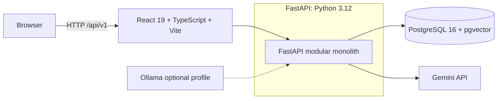
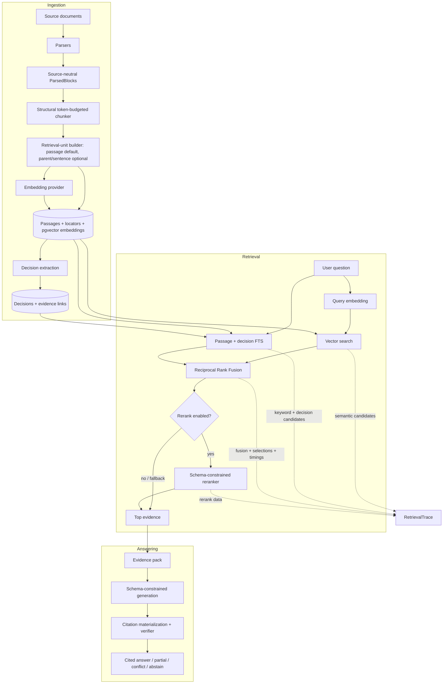

<!-- ROUTE=direct | WRITE_READY=1 | READ_READY=0 | EXISTING=0 | PLANNED_DISPATCH=0 | LEAD=/root | REASON=review_cost | DETAIL=Single README diagram accuracy correction; delegation adds transfer and acceptance review on one shared document. -->

# 🧠 Decision Memory Assistant

###### Evidence-first decision history for project teams

Turn project notes, specifications, meeting records, PDFs, and Word documents into a searchable memory of decisions. Ask *“Why was authentication postponed, who decided it, and was it later changed?”* and receive a concise, cited answer, ordered timeline, and exact source passages.

---

## 🛡️ Architecture



The browser owns presentation and interaction state. FastAPI owns domain rules, persistence, ingestion, retrieval, evaluation, provider calls, and secret isolation. PostgreSQL stores the local corpus, decisions, audit history, and retrieval traces; Gemini is the default model provider, while Ollama is optional.

---

## 📚 Table of Contents

- [Overview](#-overview)
- [Key Features](#-key-features)
- [FastAPI + RAG System](#-fastapi--rag-system)
- [Technology Stack](#-technology-stack)
- [Installation & Setup](#-installation--setup)
- [Usage](#-usage)
- [Corpus Reset & Reingestion](#-corpus-reset--reingestion)
- [Evaluation](#-evaluation)
- [Testing](#-testing)
- [Privacy & Limitations](#-privacy--limitations)
- [Troubleshooting](#-troubleshooting)

---

## 📌 Overview

Decision Memory Assistant is local-data-first decision intelligence for project evidence. It extracts structured decisions from documents, preserves immutable source versions and locators, and refuses to invent missing support. When evidence is absent, it abstains; when evidence conflicts, it presents competing passages instead of silently choosing one.

### What this project demonstrates

- Hybrid RAG with semantic search, PostgreSQL full-text search, structured decision fields, and Reciprocal Rank Fusion (RRF).
- Structural, token-budgeted chunking with source locators and corpus-profile safety.
- Evidence-only, schema-constrained generation with citation validation, repairs, conflict handling, and abstention.
- Versioned document ingestion, manual decision corrections, revision history, timelines, inspectable retrieval traces, and benchmark evaluation.

---

## ✨ Key Features

| Capability | Implemented behavior |
| --- | --- |
| 📄 **Document ingestion** | Upload `.md`, `.txt`, `.pdf`, and `.docx`; preserve line, page, paragraph, and offset locators. Empty/scanned, encrypted, and corrupt PDFs receive explicit errors. |
| 🧩 **Decision extraction** | Extract statement, date, owner, status, reasons, alternatives, topic, and candidate relationships, each tied to evidence. |
| ✏️ **Human correction** | Edit structured decision fields without changing source text. Corrections create audit revisions with `supported`, `unsupported`, or `needs_review` labels. |
| 🔎 **Hybrid retrieval** | Fuse vector, passage full-text, and decision-field search with RRF; store an inspectable trace for every query. |
| ✅ **Cited answers** | Return atomic cited claims; deterministically verify quotes, hashes, offsets, central claims, and conflicts before answering. |
| 🗓️ **Decision timelines** | Build chronological, evidence-backed histories with `supersedes`, `revises`, and `relates_to` relationships. |
| 📊 **Evaluation** | Compare semantic-only and hybrid retrieval on the versioned Atlas benchmark with stored diagnostics. |
| 🔐 **Private workspaces** | Keep each business query scoped to its owner-private workspace; local username/password authentication uses Argon2 and bearer tokens. |

---

## ⚙️ FastAPI + RAG System

### RAG architecture



### Evidence path

```text
Upload → parse into source-neutral blocks → structural chunks → embeddings
      → vector + FTS + decision retrieval → RRF → optional rerank
      → evidence pack → schema-constrained answer → verifier → cited answer / partial / conflict / abstain
```

- **Ingestion** normalizes every supported source into `ParsedBlock` values, then applies one token-budgeted structural chunker. Chunks retain exact locators and do not cross hard source boundaries.
- **Retrieval** combines semantic search, PostgreSQL English full-text search, and structured decisions. RRF creates candidate order; disabled-by-default reranker may only reorder supplied candidates and fails open to RRF.
- **Answering** separates trusted system instructions from untrusted questions and document evidence. It validates citations against stored source content and abstains safely when support is insufficient.
- **Observability and evaluation** store retrieval candidates, fusion/rerank details, timings, selected-passage metadata, corpus snapshots, and answer-pipeline diagnostics.

### FastAPI modules

| Domain | Responsibility |
| --- | --- |
| `auth` | Signup, login, credential recovery, password/username changes, and local bootstrap account. |
| `workspace` | Owner-private workspaces, activation, and embedding/chunking corpus-profile guards. |
| `documents` + `ingestion` | Uploads, source storage, background indexing, parsing, chunking, embeddings, and active-version replacement. |
| `decisions` | Decision records, evidence links, corrections, revision history, and relationships. |
| `retrieval` | Hybrid search, RRF, optional reranking, hierarchical evidence selection, and retrieval traces. |
| `answering` | Evidence-pack construction, structured generation, citation materialization, verification, repairs, and abstention. |
| `timelines` | Topic matching, relationship expansion, chronology, and timeline responses. |
| `evaluation` | Versioned benchmark runs, corpus snapshots, retrieval metrics, citation checks, and diagnostics. |
| `providers` | `GenerationProvider` and `EmbeddingProvider` contracts, Gemini/Ollama adapters, and deterministic test fakes. |

All business endpoints use `/api/v1`. `/health`, `/ready`, `/docs`, and `/openapi.json` are intentionally unversioned.

---

## 🛠️ Technology Stack

| Component | Technologies |
| --- | --- |
| Frontend | React 19, TypeScript, Vite, React Router |
| Backend | Python 3.12, FastAPI, SQLAlchemy, Alembic |
| Data | PostgreSQL 16, pgvector, PostgreSQL full-text search |
| AI providers | Gemini by default; Ollama via optional Compose profile |
| Retrieval | Structural chunking, embeddings, RRF, optional schema-constrained reranking |
| Local runtime | Docker Compose |
| Testing | pytest, pytest-asyncio, Vitest, Testing Library |

---

## 🚀 Installation & Setup

### Prerequisites

- Git and Docker Desktop
- Gemini API key and network access for live model calls
- No host Python, Node, npm, or PostgreSQL required

### 1️⃣ Clone and configure

```bash
git clone <this-repo>
cd decision_assistant
cp -n .env.example .env
```

Set these required values in untracked `.env`. Never commit or log them.

```dotenv
GEMINI_API_KEY=<gemini-api-key>
AUTH_JWT_SECRET=<long-random-secret>
AUTH_BOOTSTRAP_USERNAME=<initial-owner-username>
AUTH_BOOTSTRAP_PASSWORD=<initial-owner-password>
```

`GEMINI_API_KEY` is needed only for live inference. Fake-provider tests and deterministic smoke flow run without it. On first startup, API creates bootstrap account; its password and JWT secret must remain private.

### 2️⃣ Build and start

```bash
docker compose build
docker compose up -d db --wait
docker compose run --rm api alembic upgrade head
docker compose up -d api web --wait
```

### 3️⃣ Verify

```bash
docker compose exec api alembic current
curl -i http://localhost:8000/ready
docker compose ps
```

Open [http://localhost:5173](http://localhost:5173). FastAPI OpenAPI docs: [http://localhost:8000/docs](http://localhost:8000/docs).

### Service checks

- `GET /health` checks process/database liveness; stays green during provider, migration, or corpus-profile problems.
- `GET /ready` returns `200` only when schema, configured provider settings, and corpus profiles are ready; otherwise sanitized `503`.
- `GET /docs` provides interactive API documentation.

### Optional Ollama provider

```bash
docker compose --profile ollama up -d ollama
# Set GENERATION_PROVIDER=ollama and EMBEDDING_PROVIDER=ollama in .env.
```

After normal source changes, use `docker compose build`, run migrations, then `docker compose up -d --wait`. Clean rebuild only for deliberate local cleanup:

```bash
# WARNING: deletes every project Docker volume and its data.
docker compose down --volumes --remove-orphans --rmi all
docker compose build --no-cache --pull
```

---

## 🧭 Usage

1. Sign in with bootstrap credentials; create or activate workspace.
2. Upload Atlas sample files or project documents; wait for indexing.
3. Open decision; correct structured metadata if needed; review evidence and revision history.
4. Ask question; inspect citations, conflicts, abstentions, developer retrieval trace.
5. Open Timeline to trace topic through related and superseding decisions.
6. Run semantic-only and hybrid evaluations from Evaluation dashboard.

### Deterministic demo

```bash
SMOKE_PROVIDER_MODE=fake bash scripts/smoke.sh
# expected: SMOKE PASS: upload -> index -> ask -> citation -> timeline
```

Live Gemini acceptance flow:

```bash
SMOKE_PROVIDER_MODE=gemini bash scripts/smoke.sh
```

---

## 🔄 Corpus Reset & Reingestion

Embedding profile includes provider, model, dimension, and adapter configuration. Chunking profile includes algorithm, encoding, and token budgets. Different profiles cannot be compared.

This development project has no legacy-corpus compatibility or in-place corpus migration. When either profile changes, app returns `corpus_reset_required`. Reset PostgreSQL only, then reingest every source:

```bash
docker compose stop api web
docker compose exec -T db sh -lc \
  'dropdb --if-exists --force -U "$POSTGRES_USER" "$POSTGRES_DB" && createdb -U "$POSTGRES_USER" "$POSTGRES_DB"'
docker compose run --rm api alembic upgrade head
docker compose up -d api web --wait
docker compose run --rm -T api \
  python /workspace/scripts/ingest_corpus.py \
  --api-origin http://api:8000 \
  --source-directory /workspace/sample_data/atlas \
  --workspace-name Atlas
```

This preserves `uploads_data`, `ollama_data`, and `web_node_modules`; resets PostgreSQL only. Do not use `docker compose down -v` for this workflow.

---

## 📊 Evaluation

`evaluation/questions.json` contains versioned Atlas benchmark: answerable, unsupported, multi-part, supersession, and conflict questions with expected evidence and statuses.

Measured results exist only after live provider run; not fabricated here. Compare stored metrics:

- Top-five retrieval hit rate and mean reciprocal rank
- Citation correctness and gold-citation coverage
- Answer faithfulness and answer/facet abstention accuracy
- Median and p95 end-to-end and stage latency

Benchmark target: hybrid top-five hit rate ≥80% on answerable questions. Diagnostics preserve generation attempts, verification failures, dropped citations, and repair outcomes without prompts, full evidence packs, or secrets.

---

## 🧪 Testing

All tests run through Docker Compose.

```bash
make test-api    # pytest; live_provider tests excluded by default
make test-web    # Vitest + Testing Library
make migrate     # Alembic upgrade head
make smoke       # deterministic fake-provider smoke flow
```

- API: parsers, chunking, locators, RRF, reranking, evidence alignment, citations, abstention, timelines, corpus guards, provider fakes, API integration.
- Web: uploads, ingestion status, citations, conflicts, errors, polling, corrections, timelines, evaluation, accessibility behavior.
- Live provider contracts marked `live_provider`; run only when live Gemini/Ollama execution intended.

---

## 🔒 Privacy & Limitations

Source files, DB records, embeddings, and traces persist in local Docker volumes. App is not fully offline when Gemini selected: normalized passage text for embeddings, questions, selected evidence, extraction material, and evaluation payloads go to Gemini under Google terms.

Original binary files, local paths, DB credentials, API keys, unrelated answer-time passages, and application telemetry do not go to Gemini. Use fictional Atlas corpus for demos; do not ingest confidential material without accepting provider terms.

Supported formats: Markdown, text, PDFs with embedded text, DOCX. Scanned PDFs need OCR and are rejected. Complex PDF layout, tables, multi-column text, encrypted files, macros, link following, password recovery out of scope. Source text stays untrusted evidence, never system instructions.

---

## 🩺 Troubleshooting

| Symptom | Cause / fix |
| --- | --- |
| `provider_configuration_invalid` | Add `GEMINI_API_KEY`, or verify selected provider settings. |
| API exits at startup | Set `AUTH_JWT_SECRET`, `AUTH_BOOTSTRAP_USERNAME`, `AUTH_BOOTSTRAP_PASSWORD` in `.env`. |
| `provider_quota_exhausted` | Gemini free-tier quota reached; wait for reset or use another configured provider. |
| `provider_authentication_failed` | Gemini rejected key; verify value and permissions. |
| `corpus_reset_required` | Embedding or chunking profile changed; reset PostgreSQL and reingest sources. |
| Hybrid answer abstains | Active corpus lacks enough supported evidence; inspect retrieval trace. |
| Ingestion job stays `running` | API restart interrupted in-process work; use UI retry. |

---

## ⚖️ Trade-offs

- Modular monolith keeps boundaries visible without distributed-systems overhead.
- FastAPI background ingestion is in-process; API restart interrupts non-durable jobs.
- RRF is transparent; reranking stays disabled until benchmark evidence proves benefit without abstention regression.
- Gemini improves demo reliability but adds network, quota, vendor, and data-governance dependencies.
- Source anchors exact for normalized text, not pixel-perfect PDF coordinates.
